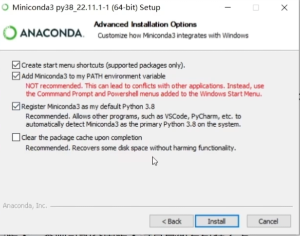

# Winter.Z 的图像识别 YOLO11 ver1.0：零基础中文使用手册

本手册面向第一次接触 Python 和 YOLO 的使用者。A、B 两版的操作命令相同，区别主要在默认训练规模。请一次只输入一条命令，等待结束后再输入下一条。

## 1. 环境配置

以下命令均在 Windows 的“命令提示符（CMD）”中执行。安装程序需要用鼠标操作的步骤除外。安装完成后，训练和识别时都要先进入 yolov11 环境。不需要填写本手册作者的用户名或盘符。

### 1.1 安装 Miniconda

从[清华镜像站下载 Miniconda 安装程序](https://mirrors.tuna.tsinghua.edu.cn/anaconda/miniconda/Miniconda3-py38_22.11.1-1-Windows-x86_64.exe)。建议安装在 C 盘。安装时进入“Advanced Installation Options”，勾选“Add Miniconda3 to my PATH environment variable”（将 Miniconda 加入 PATH）。该选项可能与电脑上已有的其他 Python 安装冲突；如果已经装好 Conda，就不必重复安装。

安装后关闭旧 CMD，重新打开 CMD。输入 conda --version；若提示找不到 conda，可从开始菜单打开 Miniconda Prompt（它也是 CMD），运行 conda init cmd.exe，再关闭并重新打开 CMD。

### 1.2 创建并激活 Python 3.10 环境

在 CMD 中运行：

~~~bat
conda create -n yolov11 python=3.10
~~~

出现“Proceed ([y]/n)?”时输入 y，再按回车。创建完成后输入：

~~~bat
conda activate yolov11
~~~

命令行左边出现 (yolov11) 才表示激活成功。以后每次新开 CMD，都要再执行 conda activate yolov11。

### 1.3 设置下载源并安装 PyTorch

继续在 (yolov11) 中逐条运行：

~~~bat
pip config set global.index-url https://mirrors.tuna.tsinghua.edu.cn/pypi/web/simple
pip install torch==1.13.1+cu116 torchvision==0.14.1+cu116 torchaudio==0.13.1 --extra-index-url https://download.pytorch.org/whl/cu116
~~~

此方案面向支持 CUDA 的 NVIDIA GTX 10 系或更新显卡，不限定具体型号；实际能否使用 GPU，以后面的环境检查和 CUDA 最小运算结果为准。没有可用 GPU 也能用 --device cpu 尝试，但训练会非常慢。不要自行把 PyTorch 升级到另一个版本后仍假设本手册的兼容性结论成立。

### 1.4 安装 Ultralytics 源码

若 yolov11 环境中已可使用 Ultralytics 8.4.112，可先跳过安装，等第 1.6 节检查。不确定时，建议使用[官方 v8.4.112 源码 ZIP](https://codeload.github.com/ultralytics/ultralytics/zip/refs/tags/v8.4.112)，而不是随时变化的 main 分支。注意：Ultralytics 软件版本号是 8.4.112，但它支持 YOLO11 模型；不需要另找一个叫“YOLO11 软件”的包。

下载并解压后，把整个 ultralytics-8.4.112 文件夹复制到桌面。回到已激活 (yolov11) 的 CMD：

~~~bat
cd /d "%USERPROFILE%\Desktop\ultralytics-8.4.112"
pip install -e .
~~~

如果你的文件夹实际叫 ultralytics-main，请在 cd /d 命令中写实际文件夹名。-e 表示可编辑安装。若 pip 需要下载依赖，请等它完成，不要关闭 CMD。

### 1.5 下载并进入本项目

打开[项目 Releases 页面](https://github.com/zhangyunzhi062-sketch/test3/releases)，选择“1.0.0A 显卡友好版”或“1.0.0B 威力加强版”，下载名字含 full 的完整 ZIP 并解压。完整包已包含三套原始数据和相应的官方初始训练权重。也可以在仓库页面点击“Code → Download ZIP”下载源码；源码 ZIP 含三套数据，但**不含初始权重**，首次训练需联网下载或自行放入权重文件。

打开解压后的项目根文件夹，确认看得到 train.py、config、database 和“待检测图片”。在资源管理器地址栏复制该文件夹的完整路径。返回 (yolov11) 的 CMD，输入下方命令，把引号内的“项目解压目录”替换为实际路径：

~~~bat
cd /d "项目解压目录"
~~~

cd /d 可以同时切换盘符。路径中有空格或中文时，保留双引号；不要原样输入“项目解压目录”几个字。

### 1.6 安装项目依赖并检查环境

仍在项目根目录、(yolov11) 环境中，逐条运行：

~~~bat
pip install -r requirements.txt
python -m pip check
python check_environment.py
~~~

requirements.txt 会把 NumPy 固定到 1.26.4、OpenCV 固定到 4.11.0.86，以适配已有的 PyTorch 1.13.1。pip check 应显示“No broken requirements found.”。环境检查会列出 Python、PyTorch、Ultralytics、CUDA 和最小 GPU 运算结果；看到“环境检查完成”即可继续。若只出现“当前显卡架构未直接列入 PyTorch 编译架构”的警告，但最小 CUDA 运算通过，可以继续。若检查指出 NumPy 2、OpenCV 5 或 CUDA 运算失败，先阅读第 6 节，不要直接开始训练。

## 2. A、B 两版默认设置

打开根目录的 VERSION 文件，可以看到当前完整包是 1.0.0A 还是 1.0.0B。train.py 默认读取 config\project.yaml，也就是该包的默认版本。两个独立配置还保存在 config\project-a.yaml、config\project-b.yaml；临时使用另一版参数时可加 --config 指定。

| 设置 | 1.0.0A 显卡友好版 | 1.0.0B 威力加强版 |
| --- | --- | --- |
| 初始训练权重 | yolo11n.pt | yolo11x.pt |
| 最多训练轮数 epochs | 100 | 1000 |
| 输入边长 imgsz | 640 | 832 |
| 每批图片 batch | 8 | -1（自动估计） |
| 数据读取进程 workers | 0 | 48 |
| 提前停止等待 patience | 30 轮 | 200 轮 |
| 随机种子 / 训练设备 | 42 / GPU 0 | 42 / GPU 0 |
| 优化与增强 | Ultralytics 默认 | AdamW、余弦学习率、多尺度、最后 30 轮关闭 Mosaic、内存缓存 |
| 默认训练输出 | runs\detect\uav_tree_stone | runs\detect\uav_tree_stone_yolo11x_accurate |

workers 是**数据读取进程数，不等于模型“使用的 CPU 核数”**。B 版面向资源较多的机器；48 可用 --workers 改，例如 --workers 16。1000 是上限，若验证指标长期没有提升，patience=200 会提前停止。更大的模型与更久的训练不保证实际航拍照片更准确，应以验证结果和新图片效果判断。

两版检测默认设置相同：不写 --source 时检测根目录的“待检测图片”；不写 --model 时读取 runs\detect\uav_tree_stone\weights\best.pt；置信度阈值 0.25、NMS IoU 阈值 0.70、输入尺寸 640、GPU 0；结果写入 outputs\predict，并尝试自动打开。B 版新训练产生的 best.pt 在它自己的训练输出目录，检测 B 版成果时须用 --model 指定（见第 5 节）。新解压的项目里**尚无 best.pt**：完整包里的 yolo11n.pt/yolo11x.pt 是通用初始权重，必须先训练才能识别本项目的 tree/stone 类别。

## 3. 准备三套数据

database 文件夹已包含 Nature objects、Stone、Tree-Top-View 三套原始数据，不需要另行下载，也不需要改盘符。进入项目根目录后运行：

~~~bat
python prepare_dataset.py
~~~

程序会检查类别名称、图片及标签，把 Nature 的 rock 归为 stone、tree/trunk 归为 tree，忽略 road/water；把 Stone 的多边形标签转为检测框；把 Tree-Top-View 的 tree-top 归为 tree。原始文件不变，新数据生成到 generated\uav-tree-stone.v1.yolov11。正常情况下合计 742 张图片（train 516、valid 152、test 74）。

若已准备过数据，再运行会拒绝覆盖。确认要重建**本程序生成的目录**时，运行：

~~~bat
python prepare_dataset.py --overwrite
~~~

程序只允许覆盖带安全标记的派生数据目录；请勿手动把重要文件放进 generated。

## 4. 训练自己的模型

数据准备成功后运行：

~~~bat
python train.py
~~~

看到训练进度后等待完成。程序会在每轮之后进行验证并保存图表、CSV 和权重；训练期间不要关闭 CMD。想改轮数、批次或读取进程，可在同一条命令后追加参数，例如：

~~~bat
python train.py --epochs 500 --batch 4 --workers 0
~~~

若想用另一种官方 YOLO11 初始模型，例如 yolo11s.pt，可输入：

~~~bat
python train.py --model yolo11s.pt --epochs 500
~~~

完整包只带当前版本的 n 或 x 权重，其他权重可能需要联网下载。若显存不足，先试 --batch 2，再考虑 --imgsz 512。B 版如在数据读取时资源紧张，可试 --workers 8；在无桌面的计算节点上训练无需打开结果目录。

训练结果默认在 runs\detect 下：A 版是 uav_tree_stone，B 版是 uav_tree_stone_yolo11x_accurate。若同名目录已存在，Ultralytics 可能添加编号，请以训练结束时打印的实际输出路径为准。该目录里的 results.csv 是绘图原始数据；results.png、PR_curve.png、confusion_matrix.png 等是由训练或验证生成的图。可重点看验证集的 Precision、Recall、mAP50、mAP50-95，不要只看训练损失下降。weights\best.pt 是验证表现最佳的已训练模型；weights\last.pt 是最近一次检查点。

如果训练中断，找出实际输出目录中的 last.pt，并运行：

~~~bat
python train.py --resume "runs\detect\uav_tree_stone\weights\last.pt"
~~~

B 版请把路径中的目录名换成自己的 B 版输出目录。续训依赖原训练记录与数据路径，尽量不要在续训前移动项目。--resume 是继续原训练，不等于从 best.pt 开始一次全新训练。

## 5. 识别图片并查看结果

最省事的方法：把待检测的 JPG、JPEG、PNG、BMP、TIF、TIFF 或 WEBP 图片复制进项目根目录的“待检测图片”，再运行：

~~~bat
python predict_image.py
~~~

上面默认使用 runs\detect\uav_tree_stone\weights\best.pt。若只检测一张指定图片，在同一条命令中写 --source：

~~~bat
python predict_image.py --source "要检测的图片完整路径.jpg"
~~~

若训练的是 B 版，通常需要同时指出 B 版的已训练权重：

~~~bat
python predict_image.py --model "runs\detect\uav_tree_stone_yolo11x_accurate\weights\best.pt" --source "要检测的图片完整路径.jpg"
~~~

--model 后面必须是实际存在的 best.pt **文件**，不是 weights 文件夹。也可把 --source 指向整个图片文件夹。一次命令只写一次 python predict_image.py，不要把两条命令连在同一行。程序完成后会自动打开本次结果目录；在远程超算或无桌面系统上可加 --no-open。

结果通常在 outputs\predict；已有结果时会用 predict_2、predict_3 等新目录，避免覆盖。images 子目录是带框图片；detections.json 和 detections.csv 记录每个检测框的类别、置信度与坐标。没有检测到目标时，程序仍会保存图片，CSV 可能只有表头。若结果目录没有自动打开，终端会打印路径，可手动打开。

## 6. 常见问题

| 现象 | 处理办法 |
| --- | --- |
| conda 或 python 找不到 | 重新打开 CMD，确认 Miniconda 已安装并执行 conda activate yolov11；必要时运行 conda init cmd.exe 后重开 CMD。 |
| 出现 NumPy 2 / _ARRAY_API not found / OpenCV 依赖冲突 | 在 (yolov11) 且位于项目根目录时运行 pip install -r requirements.txt，再运行 python -m pip check。 |
| CUDA 不可用或最小运算失败 | 更新适合显卡的 NVIDIA 驱动，核对已安装的 PyTorch 是否为 +cu116；故障未解决时可用 --device cpu 测试，但会很慢。不要仅凭“显卡型号”判断兼容性。 |
| CUDA out of memory / 显存不足 | 降低 --batch（如 2），必要时降低 --imgsz（如 512）；资源有限优先使用 A 版。 |
| 找不到数据库或类别不符 | 确认 database 内三套文件夹、data.yaml、train/valid/test 完整；重新下载项目完整包，不要随意改 class_map。 |
| 找不到生成的数据配置 | 先运行 python prepare_dataset.py，再运行 python train.py。 |
| 权重下载失败或代理错误 | 优先下载对应 Release 的 full 完整包；或从[官方 YOLO11 初始权重页面](https://github.com/ultralytics/assets/releases/tag/v8.3.0)下载 yolo11n.pt/yolo11x.pt 并放在项目根目录。不要把网页错误内容保存成 .pt。 |
| 找不到 best.pt | 先完成训练；确认 --model 指向 best.pt 文件，不要指向 weights 目录；B 版注意使用 B 版训练输出目录。 |
| 路径有空格、中文或换盘符 | CMD 进入项目用 cd /d "完整目录"；--source 和 --model 的路径也用双引号包住。 |
| 检测目录没有打开 | 看终端打印的 outputs 路径；远程机器请用 --no-open，结果仍会保存。 |

三套原始数据与官方权重的来源见[数据来源](数据来源.md)。
